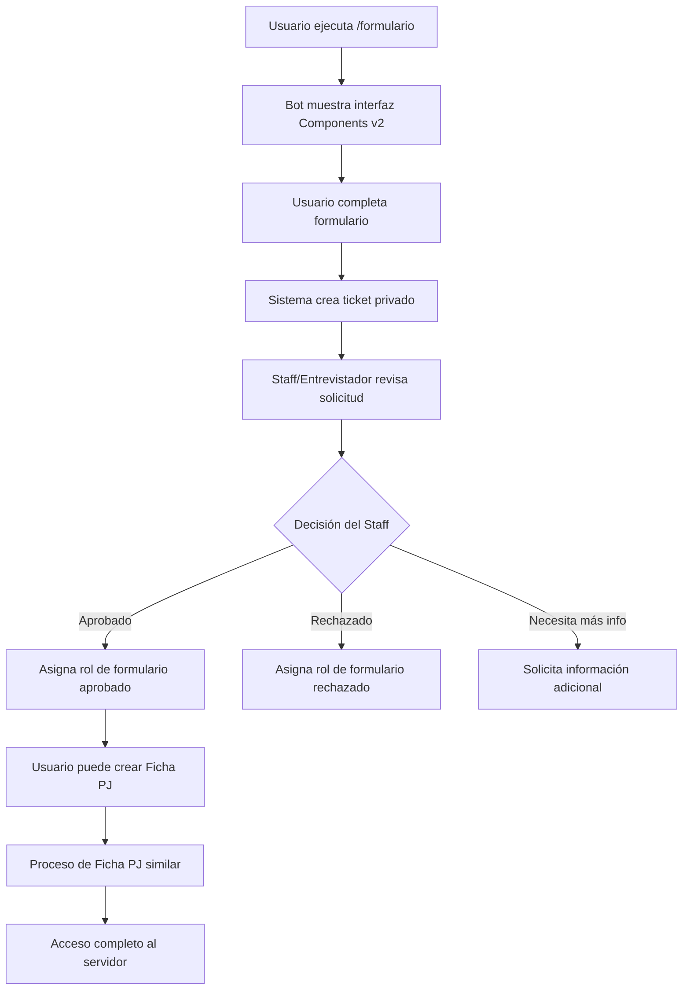
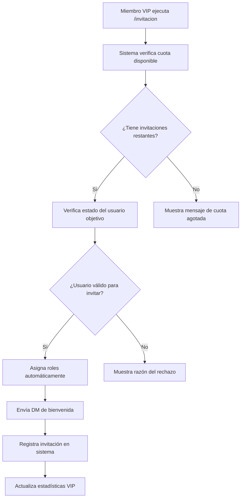

# 🎮 GTA Stories Bot - Sistema de Whitelist Avanzado

<div align="center">

[](https://discord.js.org/)
[](https://nodejs.org/)
[](LICENSE)
[](https://github.com/luckav-dev/Bot-Whitelist/stargazers)

*Bot de Discord de última generación para servidores de roleplay FiveM*

[🚀 Instalación](#-instalación) • [⚙️ Configuración](#️-configuración) • [📖 Comandos](#-comandos) • [🛠️ Desarrollo](#️-desarrollo)

</div>

---

## 📋 Descripción del Proyecto

**GTA Stories Bot** es una solución completa y automatizada para la gestión de servidores de Discord especializados en roleplay de FiveM. Desarrollado con las últimas tecnologías de Discord.js v14 y utilizando los **nuevos Components v2**, este bot revoluciona la experiencia de gestión de whitelist, fichas de personajes y administración comunitaria.

### 🎯 **¿Por qué elegir GTA Stories Bot?**

- ✅ **Components v2 de Discord**: Interfaz moderna con ContainerBuilder y TextDisplayBuilder
- ✅ **Sistema de roles automatizado**: Gestión inteligente de permisos y estados
- ✅ **Base de datos JSON optimizada**: Almacenamiento eficiente y consultas rápidas
- ✅ **Sistema de recordatorios inteligente**: Seguimiento automático de solicitudes pendientes
- ✅ **Transcripts HTML automáticos**: Registro completo de todas las interacciones
- ✅ **Sistema VIP de invitaciones**: Funcionalidad exclusiva para miembros privilegiados

---

## ✨ Características Principales

### 🔐 **Sistema de Whitelist Inteligente**
```yaml
Funcionalidades:
  - Formularios interactivos con Components v2
  - Proceso de revisión automatizado por staff
  - Sistema de roles por estados (aprobado, rechazado, suspenso)
  - Generación automática de transcripts HTML
  - Notificaciones por mensaje directo
  - Recordatorios automáticos para solicitudes pendientes
```

### 👤 **Gestión Avanzada de Fichas PJ**
```yaml
Características:
  - Creación de personajes paso a paso
  - Validación automática de campos
  - Sistema de aprobación por niveles
  - Historial completo de modificaciones
  - Estados de suspenso progresivos (1°, 2°, 3° suspenso)
  - Backup automático de datos críticos
```

### 📊 **Sistema de Encuestas Dinámicas**
```yaml
Tipos de Encuestas:
  - Encuestas Sí/No: Decisiones rápidas y binarias
  - Encuestas Múltiples: Hasta 10 opciones personalizables
  - Resultados en tiempo real con estadísticas detalladas
  - Cierre automático o manual de encuestas
  - Exportación de resultados en formato JSON
```

### 🎫 **Sistema VIP de Invitaciones**
```yaml
Funcionalidades VIP:
  - 3 invitaciones por miembro VIP
  - Tracking completo de invitados por usuario
  - Validaciones de seguridad (usuarios rechazados, suspendidos)
  - Asignación automática de roles especiales
  - Estadísticas globales de invitaciones
```

### 📈 **Dashboard de Estadísticas**
```yaml
Métricas Disponibles:
  - Estadísticas individuales por entrevistador
  - Ranking de entrevistadores por eficiencia
  - Métricas globales del servidor
  - Tasas de aceptación y rechazo
  - Histórico de actividad del sistema
```

---

## 🏗️ Arquitectura del Sistema

```
📁 GTA-Stories-Bot/
├── 📂 commands/                    # Comandos slash del bot
│   ├── 🟦 formulario.js           # Sistema principal de whitelist
│   ├── 🟦 encuesta.js             # Gestión de encuestas dinámicas  
│   ├── 🟦 entrevstats.js          # Dashboard de estadísticas
│   ├── 🟦 invitacion.js           # Sistema VIP de invitaciones
│   ├── 🟦 verformularios.js       # Consulta de formularios
│   ├── 🟦 viewstats.js            # Estadísticas generales
│   ├── 🟦 say.js                  # Utilidad de mensajes
│   └── 🟦 clear.js                # Limpieza de canales
├── 📂 events/                      # Eventos del bot
│   └── 🟨 interactionCreate.js    # Manejo de interacciones
├── 📂 utils/                       # Utilidades del sistema
│   ├── 🟩 database.js             # Gestión de base de datos
│   ├── 🟩 emojiManager.js         # Gestor de emojis personalizados
│   ├── 🟩 reminderSystem.js       # Sistema de recordatorios
│   ├── 🟩 roleChecker.js          # Validador de permisos
│   ├── 🟩 encuestas.js            # Lógica de encuestas
│   ├── 🟩 presenceManager.js      # Gestor de presencia del bot
│   └── 🟩 consoleDisplay.js       # Display de consola avanzado
├── 📂 database/                    # Base de datos JSON
│   ├── 📄 formularios.json        # Datos de formularios
│   ├── 📄 fichasPJ.json           # Fichas de personajes
│   ├── 📄 encuestas.json          # Encuestas activas/cerradas
│   ├── 📄 invitations.json        # Sistema de invitaciones
│   └── 📄 interviewers.json       # Estadísticas de entrevistadores
├── 📂 emojis/                      # Emojis personalizados
├── 📂 transcripts/                 # Transcripts HTML generados
├── 🟪 index.js                     # Archivo principal del bot
├── 🟪 deploy-commands.js           # Deploy de comandos slash
├── 🟪 config.json                 # Configuración del sistema
├── 🟪 emojis.json                 # Mapeo de emojis
└── 🟪 package.json                # Dependencias y scripts
```

---

## 🚀 Instalación y Configuración

### 📋 **Prerrequisitos**

```bash
# Versiones requeridas
Node.js >= 16.0.0
npm >= 8.0.0
Discord Bot Application con permisos de administrador
```

### ⚡ **Instalación Rápida**

```bash
# 1. Clonar el repositorio
git clone https://github.com/luckav-dev/Bot-Whitelist.git
cd Bot-Whitelist

# 2. Instalar dependencias
npm install

# 3. Configurar el bot (ver sección de configuración)
cp config.json.example config.json
nano config.json

# 4. Desplegar comandos slash
npm run deploy

# 5. Iniciar el bot
npm start
```

### ⚙️ **Configuración Avanzada**

#### **config.json - Estructura Completa**

```json
{
  "bot": {
    "token": "TU_BOT_TOKEN_AQUI",
    "clientId": "TU_APPLICATION_ID_AQUI", 
    "guildId": "TU_GUILD_ID_AQUI"
  },
  "canales": {
    "FormChannelId": "ID_CANAL_FORMULARIOS",
    "resultsChannelId": "ID_CANAL_RESULTADOS", 
    "fichasLogsChannelId": "ID_CANAL_LOGS_FICHAS",
    "ticketsCategoryId": "ID_CATEGORIA_TICKETS"
  },
  "rolesAprobacion": {
    "formularioRoleId": "ID_ROL_FORMULARIO_APROBADO",
    "FichaPjRoleid": "ID_ROL_FICHA_APROBADA"  
  },
  "rolesStaff": {
    "entrevistadorRoleId": "ID_ROL_ENTREVISTADOR",
    "staffRoleId": "ID_ROL_STAFF"
  },
  "rolesEspeciales": {
    "vipRoleId": "ID_ROL_VIP",
    "invitadoRoleId": "ID_ROL_INVITADO"
  },
  "rolesSuspenso": {
    "formRechazadoRoleId": "ID_ROL_FORMULARIO_RECHAZADO",
    "suspenso1ficharoleid": "ID_ROL_PRIMER_SUSPENSO", 
    "suspenso2ficharoleid": "ID_ROL_SEGUNDO_SUSPENSO",
    "suspenso3ficharoleid": "ID_ROL_TERCER_SUSPENSO"
  }
}
```

#### **Permisos del Bot Requeridos**

```yaml
Permisos Básicos:
  - Manage Roles: Para asignar roles automáticamente
  - Manage Channels: Para crear tickets y categorías  
  - Send Messages: Para envío de mensajes y respuestas
  - Embed Links: Para mensajes enriquecidos
  - Attach Files: Para transcripts y archivos
  - Use Slash Commands: Para comandos de aplicación

Permisos Avanzados:
  - Manage Messages: Para limpieza de canales
  - Create Private Threads: Para hilos privados
  - Send Messages in Threads: Para comunicación en hilos
  - Mention Everyone: Para notificaciones importantes
```

---

## 📖 Sistema de Comandos

### 🔐 **Comandos de Whitelist**

| Comando | Descripción | Permisos | Parámetros |
|---------|-------------|----------|------------|
| `/formulario` | 🎯 Inicia el proceso de solicitud de whitelist | `@everyone` | Ninguno |
| `/verformularios` | 📋 Consulta formularios de usuarios específicos | `Staff/Entrevistador` | `<usuario>` `<tipo>` |
| `/viewstats` | 📊 Muestra estadísticas generales del sistema | `Staff` | Ninguno |

### 👤 **Comandos de Fichas PJ**

| Comando | Descripción | Permisos | Parámetros |
|---------|-------------|----------|------------|
| `/entrevstats` | 📈 Estadísticas detalladas de entrevistadores | `Staff` | `[entrevistador]` |

### 📊 **Comandos de Encuestas**

| Comando | Descripción | Permisos | Parámetros |
|---------|-------------|----------|------------|
| `/encuesta` | 🗳️ Crea nueva encuesta personalizada | `Staff` | Ninguno |
| `/cerrarencuesta` | ❌ Cierra una encuesta activa | `Staff` | `<id>` |

### 🎫 **Comandos VIP**

| Comando | Descripción | Permisos | Parámetros |
|---------|-------------|----------|------------|
| `/invitacion` | ⭐ Gestiona invitaciones exclusivas VIP | `VIP` | `<usuario>` |
| `/verinvitaciones` | 📋 Consulta historial de invitaciones | `Staff` | `<tipo>` |

### 🛠️ **Comandos de Utilidad**

| Comando | Descripción | Permisos | Parámetros |
|---------|-------------|----------|------------|
| `/say` | 💬 Envía mensaje como el bot | `Staff` | `<mensaje>` |
| `/clear` | 🧹 Elimina mensajes del canal | `Staff` | `<cantidad>` |

---

## 🔧 Tecnologías y Dependencias

### 🏛️ **Stack Tecnológico**

```yaml
Backend:
  - Node.js: v16+ (Runtime de JavaScript)
  - Discord.js: v14.14.1 (Librería principal)
  - discord-html-transcripts: v3.2.0 (Generación de transcripts)

Arquitectura:
  - Event-Driven: Basado en eventos de Discord
  - Modular: Comandos y utilidades separados
  - Asíncrono: Operaciones no bloqueantes

Base de Datos:
  - JSON Files: Almacenamiento local eficiente
  - File System: Gestión nativa de archivos
  - Backup: Respaldo automático de datos críticos
```

### 📦 **Dependencias del Proyecto**

```json
{
  "dependencies": {
    "discord.js": "^14.14.1",
    "discord-html-transcripts": "^3.2.0"
  },
  "devDependencies": {
    "nodemon": "^3.0.0"
  }
}
```

### 🎨 **Características Técnicas Avanzadas**

#### **1. Components v2 de Discord**
```javascript
// Ejemplo de implementación moderna
const container = new ContainerBuilder()
  .addTextDisplayComponents([
    new TextDisplayBuilder()
      .setContent(`# 🎮 Sistema Avanzado de Whitelist`)
  ])
  .addSectionComponents([
    new SectionBuilder()
      .setButtonAccessory(botonFormulario)
  ]);
```

#### **2. Sistema de Emojis Inteligente**
```javascript
// Gestor dinámico de emojis
client.emojiManager.getEmoji('success') // ✅
client.emojiManager.getEmoji('error')   // ❌
client.emojiManager.getEmoji('loading') // 🔄
```

#### **3. Base de Datos JSON Optimizada**
```javascript
// Estructura de datos eficiente
{
  "formularios": {
    "userId123": {
      "estado": "pendiente",
      "timestamp": "2024-01-01T00:00:00Z",
      "entrevistador": "staffId456",
      "respuestas": {...}
    }
  }
}
```

---

## 🎯 Flujo de Trabajo del Sistema

### 📋 **Proceso de Whitelist**



### 🎫 **Sistema VIP de Invitaciones**



---

## 📊 Sistema de Estadísticas y Métricas

### 📈 **Dashboard de Entrevistadores**

El bot incluye un sistema completo de estadísticas que permite monitorear:

- **📊 Métricas Individuales**: Formularios y fichas procesadas por entrevistador
- **🏆 Ranking Global**: Clasificación por eficiencia y volumen
- **📈 Tasas de Aceptación**: Porcentajes de éxito por entrevistador
- **📅 Histórico Temporal**: Evolución de métricas en el tiempo
- **🎯 KPIs del Servidor**: Métricas generales de rendimiento

### 🔍 **Ejemplo de Estadísticas**

```yaml
Entrevistador: @StaffMember#1234
├── Formularios Procesados:
│   ├── Total: 45
│   ├── Aprobados: 38 (84.4%)
│   └── Rechazados: 7 (15.6%)
├── Fichas PJ Procesadas:
│   ├── Total: 32  
│   ├── Aprobadas: 28 (87.5%)
│   └── Rechazadas: 4 (12.5%)
└── Eficiencia Global: 85.7%
```

---

## 🔒 Seguridad y Validaciones

### 🛡️ **Sistema de Seguridad Integrado**

```yaml
Validaciones de Permisos:
  - Verificación automática de roles
  - Prevención de escalada de privilegios
  - Validación de canales autorizados
  - Rate limiting en comandos críticos

Protección de Datos:
  - Sanitización de inputs de usuario
  - Validación de IDs de Discord
  - Backup automático de datos críticos
  - Logs de auditoría para acciones importantes

Sistema Anti-Abuse:
  - Cooldowns en comandos de encuestas
  - Límites de invitaciones VIP
  - Validación de estados de usuario
  - Prevención de auto-invitación
```

### 🔐 **Roles y Permisos**

| Rol | Permisos | Descripción |
|-----|----------|-------------|
| **🛡️ Staff** | Gestión general, estadísticas, utilidades | Administración completa del sistema |
| **👥 Entrevistador** | Aprobar/rechazar formularios y fichas | Revisión de solicitudes de whitelist |
| **⭐ VIP** | Enviar invitaciones, bypass de formulario | Miembros privilegiados con beneficios |
| **📝 Formulario Aprobado** | Acceso a creación de fichas PJ | Primera fase completada |
| **✅ Ficha PJ Aprobada** | Acceso completo al servidor | Proceso completo de whitelist |

---

## 🚀 Scripts y Automatización

### 📜 **Scripts Disponibles**

```json
{
  "scripts": {
    "start": "node index.js",
    "dev": "nodemon index.js", 
    "deploy": "node deploy-commands.js",
    "backup": "node scripts/backup.js",
    "restore": "node scripts/restore.js",
    "stats": "node scripts/generate-stats.js"
  }
}
```

### ⚙️ **Automatizaciones del Sistema**

- **🔄 Recordatorios Automáticos**: Verificación cada 60 segundos
- **💾 Backup de Datos**: Respaldo automático diario 
- **📊 Generación de Reportes**: Estadísticas semanales
- **🧹 Limpieza de Archivos**: Eliminación de transcripts antiguos
- **🔄 Actualización de Presencia**: Estado dinámico del bot

---

## 🎮 Integración con FiveM

### 🔗 **Características Específicas para Roleplay**

```yaml
Funcionalidades FiveM:
  - Validación de experiencia en roleplay
  - Verificación de horas mínimas en FiveM
  - Sistema de fichas de personajes detalladas
  - Integración con reglas del servidor
  - Proceso de onboarding específico

Campos de Formulario:
  - Experiencia previa en roleplay
  - Conocimiento de reglas básicas
  - Horas jugadas en FiveM
  - Servidores anteriores
  - Personaje propuesto
```

### 🏆 **Características del Personaje**

- **👤 Información Personal**: Nombre, edad, trasfondo
- **🎭 Personalidad**: Rasgos, motivaciones, objetivos
- **📚 Historia**: Background detallado del personaje
- **🎯 Objetivos**: Metas dentro del servidor
- **🔗 Conexiones**: Relaciones con otros personajes

---

## 🤝 Contribución y Desarrollo

### 🛠️ **Guía para Desarrolladores**

```bash
# Setup del entorno de desarrollo
git clone https://github.com/luckav-dev/Bot-Whitelist.git
cd Bot-Whitelist
npm install
npm run dev

# Estructura de branches
main        # Código de producción estable
develop     # Desarrollo activo
feature/*   # Nuevas características
hotfix/*    # Correcciones urgentes
```

### 📋 **Proceso de Contribución**

1. **🍴 Fork** del repositorio
2. **🌿 Crear rama** (`git checkout -b feature/nueva-funcionalidad`)  
3. **💾 Commit** cambios (`git commit -m 'Añadir nueva funcionalidad'`)
4. **⬆️ Push** a la rama (`git push origin feature/nueva-funcionalidad`)
5. **🔄 Pull Request** con descripción detallada

### 🐛 **Reporte de Bugs**

```yaml
Template de Issue:
  - Descripción del problema
  - Pasos para reproducir
  - Comportamiento esperado vs actual
  - Screenshots/logs relevantes
  - Información del entorno
```

---

## 📚 Documentación Adicional

### 📖 **Guías Detalladas**

- [🔧 Guía de Configuración Avanzada](docs/configuracion-avanzada.md)
- [🎮 Integración con Servidores FiveM](docs/integracion-fivem.md) 
- [📊 Sistema de Estadísticas](docs/sistema-estadisticas.md)
- [🔐 Gestión de Permisos](docs/gestion-permisos.md)
- [🛠️ Desarrollo y API](docs/desarrollo-api.md)

### 🆘 **Soporte y Comunidad**

- **💬 Discord**: [Servidor de Soporte](https://discord.gg/gtastories)
- **📧 Email**: soporte@gtastories.es  
- **🐛 Issues**: [GitHub Issues](https://github.com/luckav-dev/Bot-Whitelist/issues)
- **📖 Wiki**: [Documentación Completa](https://github.com/luckav-dev/Bot-Whitelist/wiki)

---

## 📄 Licencia y Derechos

```
Copyright © 2024 LuckAv Development Team
Licensed under GNU General Public License v3.0

Este proyecto está licenciado bajo GPL-3.0
Ver el archivo LICENSE para más detalles
```

---

<div align="center">

### 🌟 **¿Te gusta este proyecto?**

**¡Dale una ⭐ al repositorio y compártelo con la comunidad!**

[](https://github.com/luckav-dev/Bot-Whitelist/stargazers)
[](https://github.com/luckav-dev/Bot-Whitelist/network/members)

---

**🎮 Desarrollado con ❤️ para la comunidad de GTA Stories**  
*Bot de Whitelist • Components v2 • Sistema Avanzado de Gestión*

[⬆️ Volver al inicio](#-gta-stories-bot---sistema-de-whitelist-avanzado)

</div>
